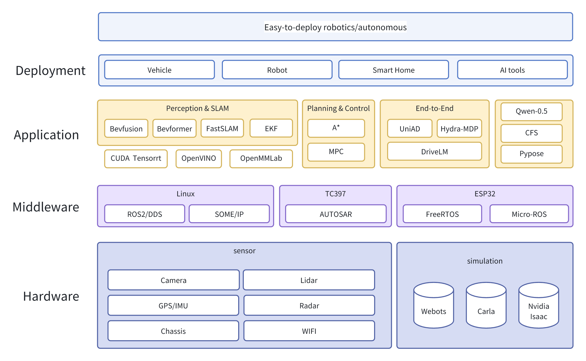
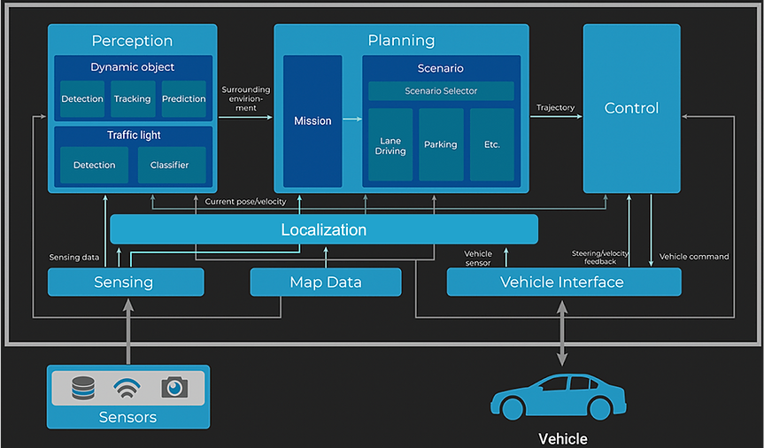

# Pegasus-Robotics
Integrate learning materials into a complete and easy-to-deploy robotics/autonomous driving project

https://zhuanlan.zhihu.com/p/470874027  C++ sum \
https://mp.weixin.qq.com/s/51gc84tilMhzaOIUUCH_Tg  C++ STL原理 \
https://mp.weixin.qq.com/s/doXVeDQTyg2ggD_pLLlG-Q  C++面经 \
https://mp.weixin.qq.com/s/DDut_ygaZWO9NNwqAQn4iw  C++面试题（腾讯 \
https://mp.weixin.qq.com/s/mvG0gogZ9914djOm3K8sxQ  C++通用基础 \
https://mp.weixin.qq.com/s/xbRXtQbrK_ATRJyBg-vHew  \
https://mp.weixin.qq.com/s/Mpm_fQZna6RChoZgQ8fvLQ  嵌入式面经 \
https://learn.microsoft.com/zh-cn/cpp/cpp/casting?view=msvc-170  C++字典 \
https://zhuanlan.zhihu.com/p/677040996  C++ 多线程  \
https://mp.weixin.qq.com/s/YKjXa_rv6QgTgP2j3ZOSBg  C++11多线程 \
https://mp.weixin.qq.com/s/2tyyZvrf1HyRactsDTjD8Q  C++coding \
https://mp.weixin.qq.com/s/3nSgjPKSUNDL-RnUM-Zgfw  Linux面试题 \

https://mp.weixin.qq.com/s/rG_2uF9IpmquVCfp6SzD0g C++ 自旋锁 \
https://mp.weixin.qq.com/s/1jHD6oUH76d4waDWHqSdrQ  Valgrind \
https://mp.weixin.qq.com/s/5-Alye3jFv-ptXXtlbPZlQ Multi-core Security \

https://mp.weixin.qq.com/s/zXl55J9qWhXTrMNN1NKgJA Linux驱动 \
https://mp.weixin.qq.com/s/cu9ZsQ78r9Gyf2l_zO_6nQ Linux系统内核 \
https://mp.weixin.qq.com/s/hY5A9LAZ4Tjp_Y4jYI_Fbg Linux嵌入式 \
https://mp.weixin.qq.com/s/R-BlGG9mMOnXuKC6coAoVg C++八股 \
https://mp.weixin.qq.com/s/ytncVkiQH2TOXw8bNayDZw 嵌入式系统 \
https://mp.weixin.qq.com/s/snVqW28UDTt6ng6ERYtgZA STL \
https://mp.weixin.qq.com/s/1gDdU4qTjhcviCvAYsDKkQ C++20 \
https://mp.weixin.qq.com/s/185ksqxKLmk-PY7J6Eh3LA C++高效lib \
https://mp.weixin.qq.com/s/_G417OTvHX_OBR2DVR9rZA C++ Protobuf \
https://mp.weixin.qq.com/s/tP6CM7lPgG4pLTl3KydQjQ Python封装 \

https://robot-ma.github.io/   具身智能抓取 \
https://dextrah-rgb.github.io/  dextrah抓取 \
https://github.com/kyegomez/rt-2   RT2 \
https://navila-bot.github.io/  VLA导航 \
https://github.com/Jirl-upenn/VLMnav  端到端导航 \
https://github.com/bagh2178/SG-Nav  零样本导航 \
https://mp.weixin.qq.com/s/ZS6kgn5YiloE2c77-EuiFQ CLIP2Scene \
https://dino-wm.github.io/  Dino WM \
Log-GPIS-MOP     定位建图导航 \
https://github.com/HongbiaoZ/autonomous_exploration_development_environment/tree/humble \
https://github.com/robodhruv/visualnav-transformer  diffusion导航 \
https://nexa.ai/blogs/omni-vision?utm_source=ai-bot.cn  VLM \
https://github.com/ethz-asl/panoptic_mapping  全景建图 \

https://www.jetson-ai-lab.com/tensorrt_llm.html   tensorrt_llm \
https://mp.weixin.qq.com/s/5lSZNuoY3DUCGsJIqmLy0A  模型部署工程化 \
https://mp.weixin.qq.com/s/zfB-4YFWLltboC7EwYptmA  onnx加速 \
https://mp.weixin.qq.com/s/5hjnbLvD1uOMcI-LyxDBvQ Openvino加速 \
https://blog.csdn.net/shanglianlm/category_8938622.html CUDA教程 \
https://mp.weixin.qq.com/s/SeOx8DTPxGYZyyed7Nq8eA  CUDA面试题 \
https://ytzfhqs.github.io/AAAMLP-CN/ Kaggle \
https://mp.weixin.qq.com/s/Eyy5VGDYrc1xDJmSsqb3tw FastDDS \
https://mp.weixin.qq.com/s/_G417OTvHX_OBR2DVR9rZA ProtoBuf \
https://zhuanlan.zhihu.com/p/678903537  LLM_CUDA \
https://mp.weixin.qq.com/s/8P8n8XAdBcEYqwaKQ49-SQ FAST Transformer CUDA \
https://mp.weixin.qq.com/s/hrOZYw6eFVU9EMl8aa3tQg onnx_tensorrt_PTQ \
https://docs.nvidia.com/deeplearning/tensorrt/polygraphy/docs/index.html Polygraphy \
https://zhuanlan.zhihu.com/p/474533871 后融合 \

https://blog.csdn.net/qq_40672115/article/details/135319174  Bevfusion \
https://blog.csdn.net/weixin_46479223/article/details/134127700 源码 \
https://zhuanlan.zhihu.com/p/543335939  \
https://oceanechy.github.io/2023/11/29/bevformer-learning/ BEVFormer \
https://mp.weixin.qq.com/s/O1jDY7KMZZUpsdm3UAer9w UniAD \
https://blog.csdn.net/CV_Autobot/article/details/140563464 UniAD \
https://zhuanlan.zhihu.com/p/642373931 UniAD \
https://mp.weixin.qq.com/s/crvIXwkeYTtOqKW4Pi77Ww  UniAd \
https://github.com/ywyeli/UniDrive  Uni Drive \
https://mp.weixin.qq.com/s/xBSk1A4o_9vVkIJohLpxgw 自动驾驶全流程 \

https://mp.weixin.qq.com/s/y2r5DZ53GhX5i0q-nMKzhg \
https://mp.weixin.qq.com/s/-5L5YlUixXeLdOUksXSLcw \
https://mp.weixin.qq.com/s/jg9Pdzzd9GR5ai65R5wc5A \
https://mp.weixin.qq.com/s/aICO5MRDDPXZdEoKer-BFQ \
https://mp.weixin.qq.com/s/2b1a0TD6g-g5ikYFUHeO_g \
https://mp.weixin.qq.com/s/0GcqA3uOBg0gvr79qkiApQ \

https://mp.weixin.qq.com/s/1ak-L3TIWg7hr3gUpwX_Rg QEMU  \
https://ubuntu.com/server/docs/boot-arm64-virtual-machines-on-qemu \
https://mp.weixin.qq.com/s/OQbao-OtZwlNXuisJzqEGw GDB  \
https://mp.weixin.qq.com/s/oDE-rzPsnc0ldvFMvztDDw Perf  \
https://mp.weixin.qq.com/s/9WNfVQIRAp5H_oD_xM7FgA CFS调度器 \
https://blog.csdn.net/liuerin/article/details/108749596 ROS2 Multithread \
